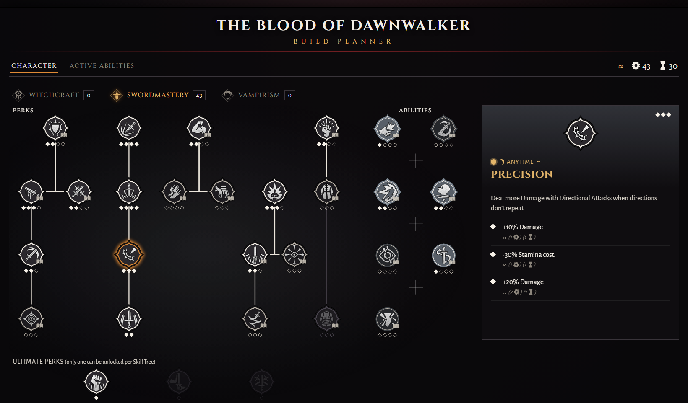

# The Blood of Dawnwalker Build Planner

Plan Coen's build for **The Blood of Dawnwalker** in the browser, on screens laid out like the game's
own: the three skill trees of the character screen and the ability wheel of the Active Abilities
screen. The whole build fits in a short code in the page address, so a link opens exactly the build
it was copied from.

**Open it at <https://nyiriattila88.github.io/dawnwalker-build-planner/>**

## What it plans

- **Perks of Witchcraft, Swordmastery and Vampirism.** Click a perk to learn a rank, right-click to
  take it back. A perk opens once the perk its line leads down from has a rank, the way the game
  draws its trees, and taking that rank back takes the perks below it too.
- **Ultimate Perks.** One per tree, and taking one closes the other two. Swordmastery and Witchcraft
  ask for 35 skill points spent on the tree's perks first, Vampirism's open with Corruption.
- **Abilities.** Every ability of every tree with its ranks, active and passive ones, and the ones the
  story grants.
- **The ability wheel.** Each tree has one slot, and one more for every rank of its slot perk
  (Forbidden Sigils, Master Fencer, Vrakhiri Might). Abilities that take no slot work once learned.
  The day quickslots take Swordmastery and Witchcraft actives, the night ones Swordmastery and
  Vampirism, as Coen fights in each form.
- **The info panel.** What a perk or an ability does at each rank, in the game's own words, what each
  rank costs in skill points and time, and when it applies: by day, by night or anytime.
- **Totals.** Skill points and time segments spent, per tree and in all.

## How sure the numbers are

The perk and ability texts are the game's own, through the [Gamer Guides
database](https://www.gamerguides.com/the-blood-of-dawnwalker/database/perks). The trees are laid out
from screenshots of the character screen.

The costs of a rank are only shown in the game while that rank is still to learn, so not all of them
have been read yet. The ones that have follow a clear pattern, and the planner fills in the rest from
that pattern. **Every estimated cost is marked ≈**, in the info panel and in the totals. If you own
the game, a screenshot of a perk or an ability with ranks still to learn helps: open an issue with
it, and the estimate becomes the game's own number. [docs/data.md](docs/data.md) lists what is read
and what is estimated.

## Behind it

React and TypeScript, with every game rule in one model that knows nothing about React and a test
suite around it. How it is built is in [docs/architecture.md](docs/architecture.md), and
[AGENTS.md](AGENTS.md) holds the instructions for working on it with an AI assistant.

A fan-made planner, not affiliated with Rebel Wolves or Bandai Namco. The game's names, texts and
icons belong to their owners; the code is under the [MIT licence](LICENSE).
